<link href="styles.css" rel="stylesheet">

# Микроконтроллеры семейства STM32F10x на 32-битном ядре ARM

# Справочное руководство

## 23. Интерфейс Full-speed USB 2.0

- <a href="#intro">23.1. Введение</a>
- <a href="#char">23.2. Основные характеристики</a>
- <a href="#func">23.3. Описание функций USB</a>
    - <a href="#block">23.3.1. Описание блоков USB</a>
- <a href="#prog">23.4. Соображения по программированию</a>
    - <a href="#regular">23.4.1. Программирование обычного USB-устройства</a>
    - <a href="#reset">23.4.2. Системный сброс и Сброс при включении МК</a>
        - <a href="#resusb">Сброс USB</a>
    - <a href="#pbuf">Структура и использование Пакетных буферов</a>
    - <a href="#epinit">Инициализация Конечной точки</a>
    - <a href="#in">Пакеты IN (передача данных)</a>
    - <a href="#out">Пакеты OUT и SETUP (приём данных)</a>
    - <a href="#ctl">Управляющие (Control) передачи</a>
    - <a href="#dblbuf">23.4.3. Конечные точки с двойной буферизацией</a>
    - <a href="#iso">23.4.4. Изохронные (Isochronous) передачи</a>
    - <a href="#susp">23.4.5. События Приостановки/Возобновления (suspend/resume)</a>
- <a href="#regs">23.5. Регистры USB</a>
    - <a href="#common">23.5.1. Общие регистры</a>
        - <a href="#USB_CNTR">Управляющий регистр USB (control, USB_CNTR)</a>
        - <a href="#USB_ISTR">Регистр состояния прерываний USB (interrupt status, USB_ISTR)</a>
        - <a href="#USB_FNR">Регистр номера фрейма USB (frame number, USB_FNR)</a>
        - <a href="#USB_DADDR">Адрес устройства USB (device address, USB_DADDR)</a>
        - <a href="#USB_BTABLE">Адрес таблицы буферов (buffer table address, USB_BTABLE)</a>
    - <a href="#epregs">23.5.2. Регистры Конечных точек</a>
        - <a href="#USB_EPnR">Регистры КТ-n, n=[0..7] (USB endpoint n register, USB_EPnR)</a>
    - <a href="#table">23.5.3. Таблица дескрипторов буферов</a>
        - <a href="#USB_ADDRn_TX">Адрес буфера отправки n (USB_ADDRn_TX)</a>
        - <a href="#USB_COUNTn_TX">Количество отправляемых байтов n (USB_COUNTn_TX)</a>
        - <a href="#USB_ADDRn_RX">Адрес буфера приёма n (USB_ADDRn_RX)</a>
        - <a href="#USB_COUNTn_RX">Количество принятых байтов n (USB_COUNTn_RX)</a>
    - <a href="#regmap">23.5.4. Карта регистров USB</a>

### 23.1. Введение

USB-периферия служит интерфейсом между полноскоростным USB 2.0 и шиной APB1.

Поддерживается Приостановка/Возобновление USB, позволяющая останавливать источники тактирования для досижения минимального энергопотребления.

### 23.2. Основные характеристики

- Соответстве спецификации Full-speed USB 2.0
- Настраиваемое число Конечных точек — от 1 до 8
- Генерация/проверка контрольной суммы CRC, NRZI-кодирование со вставкой дополнительного бита
- Поддержка Изохронного режима
- Двойная буферизация для Массивных/Изохронных (Bulk/Isochronous) конечных точек
- Операция Приостановки/Возобновления работы USB
- Синхронизация по фрейму

*В контроллерах плотности low, medium, high и XL интерфейсы USB и CAN делят между собой 512-байтный объём локальной SRAM, необходимый им для отправки и приёма данных и поэтому оба интерфейса не могут использоваться одновременно (USB и CAN должны иметь эксклюзивный доступ к этому участку памяти). Интерфейсы USB и CAN могут быть использованы в одном приложении, но не одновременно.*

### 23.3. Описание функций USB

На рисунке 220 представлена блок-схема USB-периферии контроллера.

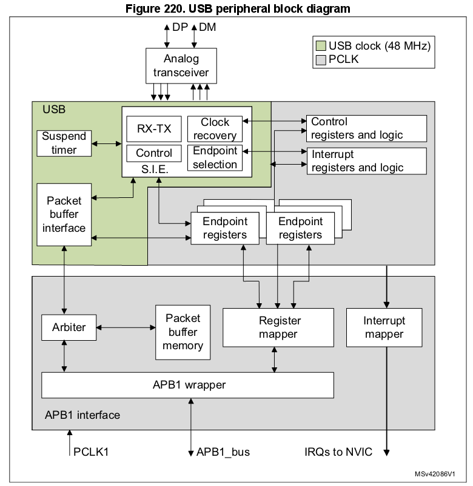

USB-периферия позволяет соединить пользовательскую фунцию микроконтроллера c ПК или другим хостом в соответствии со стандартом USB. Передача данных между хостом и МК происходит через локальную память для Пакетных буферов, к которой USB-периферия имеет непосредственный доступ. *(Размер такого участка должен соответствовать числу используемых Конечных точек и максимальному размеру USB-пакета.)* **В контроллере размер локальной пакетной памяти составляет 512 байт\*.** Может быть реализовано до 16 однонаправленных либо до 8 двунаправленных Конечных точек.

\* *— Локальная память Пакетных буферов расположена по адресу 0x40006000.*

При общении с хостом USB-периферия отвечает за детектирование пакета-токена, приём и передачу данных, а так же за необходимое "рукопожатие", в соответствии со стандартом USB. Оформление пакетов в транзакции происходит аппаратно, включая подсчёт и проверку CRC.

Для каждой Конечной точки существует свой блок описания буферов, указывающий на выделенный ей участок памяти, его размер либо требуемое число байтов для передачи. Если USB-периферия получит пакет-токен для существующей (valid) пары Функция/Конечная точка (КТ), то произойдёт соответствующая передача данных (если КТ настроена и если что-то нужно получиь/передать). Данные загружаются во внутренний 16-битный регистр USB-периферии и происходит доступ к назначенному буферу. После передачи всех данных, при необходимости, генерируется либо ожидается пакет-"рукопожатие", в зависимости от напрвления передачи.

По окончании транзакции генерируется прерывание, специфичное для КТ, в котором читаются статусные регистры и/или вызываются другие обработчики. МК может определить:

- Конечную точку, которую следует обслужить;
- тип состоявшейся транзакции;
- были ли ошибки (вставки дополнительного бита, формата, CRC, протокола, отсутствия пакета ACK, переполнение/опустошение буфера).

Для Изохронных и Массивных (Bulk) передач может быть рализована двойная буферизация, с той целью, чтобы USB-периферия могла беспрерывно пользоваться одним буфером пока ПО использует другой.

МК может быть переведён в режим низкого энергопотребления (SUSPEND), записью в управляющий регистр, если это требуется. В этот момент желательно отключить неиспользуемую периферию, тактирование USB так же может быть замедлено либо остановлено. Во время сниженного энергопотребления, активность на USB-входах будит контроллер асинхронно. Отдельный источник прерывания может быть подключен непосредственно к линии пробуждения, чтобы мгновенно возобновить нормальный режим тактирования, либо для реализации непосредственного отключения/возобновления тактирования.

#### 23.3.1. Описание блоков USB

USB-периферия содержит следующие блоки:

- **Последовательный интерфейс (Serial Interface Engine, SIE)**: В функции блока входят: распознавание паттерна синхронизации, вставка дополнительного бита, вычисление и проверка CRC, генерация/проверка PID (идентификатора пакета) и оценка "рукопожатия". Интерфейс взаимодействует с приёмопередатчиком USB и использует буферы, предоставляемые Интерфейсом Пакетных буферов (PBI), для хранения данных. Также этот блок генерирует необходимые сигланы, соответствующие событиям USB, такие как Начало фрейма (Start of Frame, SOF), сброс USB, и т.д., и сигналы, относящиеся к событиям Конечных точек, такие как окончание передачи или успешное получение пакета; такие сигналы служат для генерирования прерываний.
- **Таймер**: Блок генерирует синхронизированный относительно SOF импульс и детектирует глобальную приостановку в случае отсутствия трафика в течение 3 миллисекунд.
- **Интерфейс Пакетных буферов (Packet Buffer Interface, PBI)**: Блок управляет локальной памятью, реализуя набор буферов как для периёма, так и для передачи. Блок выбирает нужный буфер в соответствии с запросом SIE и находит его в памяти по адресу, указанному в регистрах настройки КТ. Блок увеличивает адрес после каждого принятого или отправленного 16-битного слова, пока не достигнет конца пакета, сохраняя при этом информацию о количестве принятых или переданных байт и защищая буфер от переполнения.
- **Регистры Конечных точек**: У каждой КТ есть свой регистр, описывающий её тип и текущий статус. Если КТ однонаправленная/с одним буфером, то один регистр может описывать сразу две точки различного направления. Всего регистров — 8, допускающих, таким образом, 16 однонаправленных/однобуферных КТ, либо 7 точек с двумя буферами\*, в любых комбинациях. Например, можно запрограммировать 4 КТ с двумя буферами плюс 8 однобуферных.
- **Управляющие регистры (Control Registers)**: Содержат информацию о статусе USB-периферии в целом и служат для форсирования некоторых событий, таких как возобновление работы (resume) и отключение (power-down).
- **Регистры настройки прерываний (Interrupt Registers):** Содержат маски прерываний и информацию о событиях. Могут быть использованы для выяснения источника и состояния прерывания, либо для сброса ожидающего прерывания.

\* *— КТ-0, служащая для для управляющей передачи, всегда используется в однобуферном режиме.*

USB-периферия подключена к шине APB1 через интерфейс APB1, который содержит следующие блоки:

- **Пакетная память**: Локальная память, физически содержащая Пакетные буферы. Может быть использована Интерфейсом Пакетных буферов (PBI) и так же доступна напрямую из пользовательского приложения. Объём Пакетной памяти — 512 байт, представленных как 256 16-битных слов. *(На общее пространство памяти каждое такое 16-битное слово отображено в 32-битное слово, с незначащей старшей половиной.)*
- **Арбитр**: Блок принимает запросы к памяти как от шины APB1, так и от USB-интерфейса. Он разрешает конфликты в отношении приоритета доступа к APB1, и, в то же время, всегда резервирует половину пропускной способности для того, чтобы завершить все передачи по USB. Эта схема одновременного доступа реализует SRAM с виртуальным двойным портом, что делает возможным доступ к памяти одновременно с происходящей USB-транзакцией. Благодаря такому устройству, возможны многословные APB1-передачи любой длины.
- **Маппер регистров (Register Mapper)**: Блок собирает побайтные и побитовые регистры USB-периферии в структурированный набор 16-битных слов, доступных по APB1.
- **APB1-враппер (APB1 Wrapper)**: Блок предоставляет интерфейс к APB1 для памяти и регистра. Он также отображает всю USB-периферию на адресное пространство APB1.
- **Маппер прерываний (Interrupt Mapper)**: Блок используется для определения того, как именно USB-события будут генерировать прерывания и для их назначения различным линиям NVIC:
    - **Низкоприоритетное прерывание (канал 20)**: срабатывает при наступлении любого USB-события (успешная передача, сброс USB, и т.д.). Приложение должно самостоятельно проверять источник прерывания, чтобы правильно его обработать.
    - **Высокоприоритетное прерывание (канал 19)**: срабатывает только после события успешной передачи (transfer) Изохронных или Массивных пакетов с двойной буферизацией для достижения максимальной скорости передачи.
    - **Прерывание пробуждения (канал 42)**: срабатывает по событию пробуждения из режима USB Suspend.

### 23.4. Соображения по программированию

Следующие разделы описывают взаимодействие пользовательского приложения с USB-периферией, в целях облегчения разработки ПО.

#### 23.4.1. Программирование обычного USB-устройства

Эта часть описывает основные последовательности, необходимые для достижения соответствия ПО стандарту USB. Рассматриваются действия, относящиеся к основным USB-событиям, а также описаны особые случаи: КТ с двойной буферизацией и Изохронный тип передачи. *Помимо Системного сброса, действие всегда инициирутся USB-периферией, действующей по одному из описанных ниже событий.*

#### 23.4.2. Системный сброс и Сброс при включении МК

После Системного сброса и Сброса при включении МК, первое, что ПО должно сделать — это настроить необходимые сигналы тактирования USB-периферии и затем снять её сигнал сброса, чтобы получить доступ к регистрам. Необходимая последовательность инициализации описана ниже.

**Первым шагом**, ПО должно активировать тактирование макроячейки регистров и снять сигнал сброса макроячейки, используя для этого управляющие биты логики МК.

Аналоговая часть USB-приёмопередатчика, в ключается с помощью бита `PDWN` в регистре `USB_CNTR` по определённой схеме. Бит предназначен для вкюлчения источников внутреннего напряжения, питающих приёмопередатчик. Эта цепь имеет некоторую задержку включения (tSTARTUP, указана в даташите\*), в течение которой поведение USB-приёмопередатчика не определено. Таким образом, необходимо подождать указанный интервал после того, как бит `PDWN` в регистре `USB_CNTR` будет установлен\*\* (after setting the PDWN bit) и до того, как сбросить блок USB (очисткой бита `FRES` в регистре `USB_CNTR`).

Очистка регистра `USB_ISTR`, впоследствии, сбрасывает все ложные ожидающие прерывания до того того, как будет активирована любая другая операция макроячейки.

После Системного сброса, ПО должно инициализировать все необходимые регистры и таблицу описания Пакетных буферов, чтобы USB-периферия могла правильно генерировать прерывания и передавать данные. Любые регистры, не относящиеся к какой-либо конкретной КТ должны быть инициализированы в соответствии с требованиями ПО (выбранны нужные прерывания, адреса Пакетных буферов и т.д.). После чего настройка продолжается как после Сброса USB (следующий параграф).

\* *— из даташита: tSTARTUP — 1 микросекунда; частота тактирования USB —  48 МГц от HSE.*

\*\* *— (Так как бит `PDWN`, будучи уствновлен в `1`, отключает аналоговую часть, то логично предположить, что имелась в виду не "установка" бита, а его сброс. Таким образом, необходимо выждать 1 мкс после сброса бита `PDWN` и до сброса бита `FRES`. Изначально оба бита установлены в `1`.)*

##### Сброс USB

После этого события\*, USB-периферия находится в том же сотоянии, как после инициализации после Системного сброса, описанного в предыдущем параграфе: приём и передача отключены во всех регистрах КТ (USB-периферия не будет отвечать на посылаемые ей пакеты). После Сброса USB должна быть настроена и активирована USB-Функция с адресом 0, реализованная на КТ-0. Это достигается установкой бита `EF` (Enable Function) в регистре `USB_DADDR` и инициализацией регистра `USB_EP0R` и, соответственно, его Пакетных буферов.

Во время процесса перечисления устройств USB, хост назначит контроллеру его уникальный адрес, который необходимо записать в регистр `USB_DADDR` в поле `ADD[6:0]`.

После того, как получено прерывание RESET, ПО ответственно за то, чтобы заново настроить Функцию-0 на КТ-0 в течение 10 мс, отсчитывая от окончания сброса, вызвавшего прерывание.

\* *— После физического подключения устройства к USB, хост посылает ему сигнал сброса. Периферия реагирует на него сбросом регистров `USB_EPnR` и `USB_DADDR`. Передача будет невозможна до очистки флага `RESET` в регистре `USB_ISTR`.*

##### Структура и использование Пакетных буферов

Каждая двунаправленная КТ может как получать, так и отправлять данные к хосту. Полученные данные сохраняются в выделенном буфере, зарезервированном для этой точки, в это же время второй буфер содержит данные для отправки. Доступ к памяти буферов осуществляет блок Интерфейса Пакетных буферов (PBI), он доставляет запрос на доступ к памяти и ожидает его подтверждения. Так как память Пакетного буфера в это же время должна быть доступна и микроконтроллеру, то используется арбитраж, разрешающий конфликты доступа, при котором одна половина цикла APB1 отдана в пользу МК, а вторая — USB-периферии. Таким образом, оба устройства могут работать, как если бы пакетная память была двухканальной, не беспокоясь ни о каком конфликте, даже в случае одновременного доступа.

USB-периферия использует отдельный канал тактирования. Частота канала определяется стандартом USB и составляет 48 МГц, в то же время она может быть отличной от выбранной частоты интерфейса APB1. Возможны различные конфигурации тактирования, когда частота APB1 больше, либо меньше частоты USB-периферии.

*Из-за скорости передачи данных по USB и требований интерфейса пакетной памяти, частота APB1 должна быть больше 8 МГц, чтобы избежать проблем переполнения/опустошения данных.*

Каждая Конечная точка имеет два Пакетных буфера (обычно один служит для передачи, а другой — для приёма). Буферы могут быть размещены в любой области пакетной памяти, поскольку их расположение и размер указываются в таблице дескрипторов Пакетных буферов, которая так же расположена в пакетной памяти по адресу, указываемому в регистре `USB_BTABLE`. Каждая запись в таблице связана с одним из регистров КТ и состоит из четырёх 16-битных слов, поэтому адрес начала таблицы должен всегда быть выровнен по 8-байтной границе (младшие три бита регистра `USB_BTABLE` всегда нули). Формат записей таблицы дескрипторов описан в Разделе 23.5.3. Если КТ однонаправленная и не является ни Изохронной, ни Массивной с двойной буферизацией, то, в таком случае, нужен только один буфер (соответствующий поддерживаемому направлению передачи). Области таблицы, предназначенные для неподдерживаемого направления, либо не используемые другими КТ, могут быть свободно использованы. Изохронные и Массивные КТ с двойной буферизацией взаимодействуют с Пакетными буферами особым образом (смотри Раздел 23.4.4. и Раздел 23.4.3 соответственно). Взаимосвязь таблицы дескрипторов и Пакетных буферов наглядно представлена на рисунке 221.

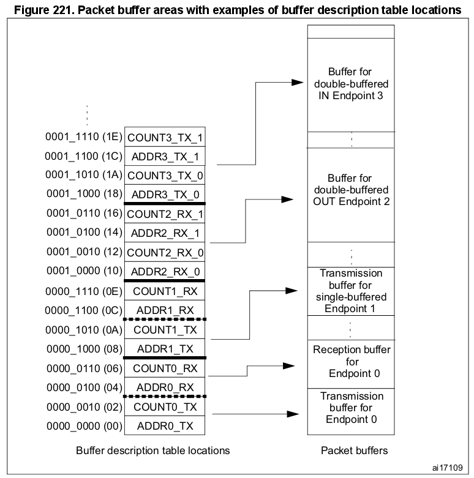

Каждый Пакетный буфер для приёма, либо для передачи, используется начиная с младшего адреса. USB-периферия никогда не будет изменять содержимое памяти по соседству с выделенными буферами; если принимаемый пакет не входит в выделенный для него буфер (произошло переполнение буфера), то будут скопированы лишь те данные, которые в него помещаются.

##### Инициализация Конечной точки

**Первый шаг по инициализации КТ** — записать правильные значения в регистры `USB_ADDRn_TX` и `USB_ADDRn_RX`, для того, чтобы сразу обеспечить USB-периферию передаваемыми данными и буфером для принимаемых данных. Поле `EP_TYPE` в регистре `USB_EPnR` должно быть установлено в соответствии с типом КТ, по необходимости задействуя бит `EP_KIND` для обеспечения особых функций. Передача должна быть включена битами `STAT_TX` в регистре `USB_EPnR`, кроме того, регистр `USB_COUNTn_TX` так же должен быть инициализирован. Для приёма должны быть установлены биты `STAT_RX`, кроме того, в регистре `USB_COUNTn_RX` должен быть указан размер выделенного буфера при помощи двух полей: `BL_SIZE` (размер блока) и `NUM_BLOCK` (количество блоков). Однонаправленные КТ, за исключением Изохронных и Массивных с двойной буферизацией, должны инициализировать только биты, соответствующие поддерживаемому ими направлению передачи. Посе того, как приём или передача будут включены, регистр КТ `USB_EPnR` и регистры табицы дескрипторов `USB_ADDRn_TX`, `USB_ADDRn_RX`, `USB_COUNTn_TX` и `USB_COUNTn_RX` не должны изменяться из ПО, так как они могут быть изменены аппаратно во время работы периферии. После окончания передачи, обозначенного генерацией прерывания CTR, регистры снова доступны и могут быть изменены для следующей операции.

##### Пакеты IN (передача данных)

Когда получен токен IN, при условии, что запрашиваемый адрес соответствует правильно настроенной КТ, USB-периферия читает содержимое `USB_ADDRn_TX` и `USB_COUNTn_TX` для этой КТ, записанное в таблице дескрипторов буферов и записывает значения во внутренние 16-битные регистры ADDR и COUNT (не доступны ПО). Затем пакетная память вновь запрашивается, но уже для чтения первого 16-битного слова, которое необходимо отправить (смотри раздел "Структура и использование Пакетных буферов" выше) и начинает передачу пакета PID для DATA0 или DATA1, в зависимости от состояния бита `DTOG_TX` региста `USB_EPnR`. После передачи пакета PID, из буфера читается первый байт слова, прочитанного ранее из пакетной памяти, и загружается в выходной сдвиговый регистр для отпрвки по шине USB. После отправки последнего байта посылается вычисленная контрольная сумма пакета — CRC.

В случае, когда запрашиваемая хостом КТ недоступна (not valid), вместо данных отправляется "рукопожатие" NAK, либо STALL, в зависимости от состояния битов `STAT_TX` регистра `USB_EPnR`.

Внутренний регистр ADDR используется в качестве указателя на текущую позицию данных в памяти, а COUNT — для подсчёта оставшихся для отправки байтов. Каждое 16-битное слово, прочитанное из памяти Пакетных буферов отправляется по USB-шине начиная с младшего байта. Из памяти буфера для отправки читается COUNTn_TX/2 слов, начиная с адреса, указанного в `USB_ADDRn_TX`. Если передаваемый пакет данных состоит из нечётного числа байт, то из последнего слова отправляется лишь младшая половина.

**При получении подтверждения ACK от хоста**, регистр `USB_EPnR` обновляется следующим образом: переключается бит `DTOG_TX`, Конечная точка объявляется временно недоступной, установкой битов `STAT_TX` в `10` (**NAK**) и установкой `CTR_TX`. ПО сперва должно определить КТ, которая требует внимания, используя для этого биты `EP_ID` и `DIR` регистра `USB_ISTR`. Обработка события `CTR_TX` начинается с очистки бита прерывания; во время обработки ПО должно подготовить новый буфер для отправки, обновить значение в `USB_COUNTn_TX`, в соответствии с количеством вновь отправляемых данных и, наконец, установить биты `STAT_TX` в `11` (VALID) для возобновения передачи. Пока биты `STAT_TX` равны `10` (NAK), любой запрос IN, адресованный к этой КТ отвергается отправлением ответа NAK, обозначая состояние управления потоком: хост будет периодически пытаться возобновить транзакцию, до тех пор, пока ему это не удастся. Важно выполнять операции в указанном выше порядке для того, чтобы не потерять очередную IN-транзакцию, адресованную этой же КТ, которая может следовать сразу за первой, вызвавшей прерывание CTR.

##### Пакеты OUT и SETUP (приём данных)

Оба этих токена обрабатываются USB-периферией примерно одинаково; отличия обработки SETUP-пакетов описаны в следующем параграфе об управляющих передачах.

При получении PID для OUT/SETUP, если полученный адрес совпадает с настроенной КТ, USB-периферия обращается к `USB_ADDRn_RX` и `USB_COUNTn_RX`, соответствующим КТ. Значение `USB_ADDRn_RX` сохраняется во внутреннем буфере ADDR. В это же время внутренний буфер COUNT сбрасывается, а значения битовых полей `BL_SIZE` и `NUM_BLOCK`, прочтённые из регистра `USB_COUNTn_RX`, используются для инициализации BUF_COUNT — внутреннего 16-битного счётчика, используемого для определения состояния переполнения. (Ни один из внутренних регистров не доступен ПО.) Байты данных, последовательно получаемые USB-периферией, упаковываются в 16-битные слова (первый байт записывается в младшую половину) и затем отправляются в Пакетный буфер по адресу, записанному во внутреннем регистре ADDR, в это же время счётчик BUF_COUNT уменьшается, а COUNT увеличивается на количество принятых байтов. После приёма пакета, обозначающего конец данных, проверяется корректность принятой контрольной суммы CRC и, если не случилось ошибок передачи, в ответ хосту отправляется пакет-"рукопожатие" ACK.

В случае неправильной контрольной суммы CRC, либо других ошибок (отсутствие дополнительного бита, ошибки фрейма и т.д.), данные всё равно будут скопированы в Пакетный буфер, как минимум до момента возникновения ошибки, однако, в этом случае пакет ACK не будет отправлен хосту, а будет установлен бит `ERR` в регистре `USB_ISTR`. В любом случае, от ПО не требуется каких-то дополнительных действий: USB-периферия сама восстанавливается от ошибок приёма и всегда готова к следующей транзакции. Если КТ в настоящий момент недоступна, то хосту, вместо ACK отправляется пакет-"рукопожатие" NAK, либо STALL, в зависимости от состояния битов `STAT_RX` регистра `USB_EPnR`, и в память Пакетных буферов ничего не будет записано.

Память Пакетного буфера для приёма заполняется, начиная с адреса, записанного в `USB_ADDRn_RX`, для всех байтов принимаемого пакета, включая CRC (т.е. размер полезных данных + 2 байта), либо до последнего возможного адреса буфера, определяемого полями `BL_SIZE` и `NUM_BLOCK`, в зависимости от того, что случится вперёд. Таким образом, USB-периферия никогда не будет писать за пределы отведённого ей буфера. Если длина получаемого пакета с полезными данными (байты, непосредственно используемые ПО) превышает размер буфера, то возникает состояние переполнения. В таком случае в ответ хосту, вместо обычного ACK, отправляется "рукопожатие" STALL, чтобы уведомить его о проблеме, прерывание не генерируется, а транзакция считается неудачной.

**Когда транзакция завершается корректно**, посылкой пакета ACK, внутренний регистр-счётчик COUNT копируется обратно в `USB_COUNTn_RX`, находящийся в таблице дескрипторов буферов, не изменяя состояение полей `BL_SIZE` и `NUM_BLOCK`, которые не нуждаются в изменении, а регистр `USB_EPnR` изменяется следующим образом: бит `DTOG_RX` переключается, КТ временно объявляется недоступной, установкой битов `STAT_RX` в `10` (**NAK**), и устанавливается бит `CTR_RX`. Если же транзакция была неудачной, то ничего из перечисленного не происходит.

Первым делом ПО определяет КТ, к которой поступил запрос, читая биты `EP_ID` и `DIR` регистра `USB_ISTR`. Обработка события `CTR_RX` начинается с определения типа транзакции (бит `SETUP` регистра `USB_EPnR`); ПО сбрасывает флаг прерывания и узнаёт сколько данных было принято, читая регистр `USB_COUNTn_RX`, находящийся в таблице дескрипторов буферов. После того, как данные были обработаны, ПО должно само установить биты `STAT_RX` регистра `USB_EPnR` в состояние `11` (VALID), разрешая тем самым следующую транзакцию. Пока биты `STAT_RX` находятся в состоянии `10` (NAK), любые запросы типа OUT, адресованные этой КТ отвергаются пакетом-"рукопожатием" NAK, обозначая таким образом состояние управления потоком: хост будет периодически пытаться возобновить транзакцию, до тех пор, пока ему это не удастся. Важно выполнять операции в указанном выше порядке, для того, чтобы не потерять очередную OUT-транзакцию, адресованную этой же КТ, которая может следовать сразу за первой, вызвавшей прерывание.

##### Управляющие (Control) передачи

Управляющие передачи выполняются постредством SETUP-транзакции, после которой могут следовать стадии передачи данных в этом же направлении и завершаются передачей статуса (ноль-байтная передача в обратном направлении).

**SETUP-транзакции обрабатываются** только управляющими КТ, по очень схожему с обработкой OUT-транзакций (приём данных) сценарию, за ислючением того, что биты `DTOG_TX` и `DTOG_RX` запрашиваемой КТ устанавливаются в значения `1` и `0` соответственно, чтобы инициализировать управляющую передачу, а так же оба поля `STAT_TX` и `STAT_RX` устанавливаются в значение `10` (NAK) для того, чтобы ПО само могло решить каким будет направление следующей транзакции — IN, либо OUT — в зависимости от содержания SETUP-пакета.

Управляющая КТ должна проверять состояние бита `SETUP` в регистре `USB_EPnR` каждый раз, при возникновении события `CTR_RX`, чтобы отличать обычные OUT-транзакции от SETUP-транзакций. USB устройство может определить количество и направление стадий передачи данных, интерпретируя сами данные во время SETUP-стадии, и обязано остановить (STALL) транзакцию в случае обнаружения ошибок. Для этого, на всех стадиях передачи данных, кроме последней, неиспользуемое направление должно быть объявлено STALL, чтобы хост, если вдруг он поменяет направление передачи раньше, чем это нужно, поучил STALL при выяснении статуса.

Во время включения последней стадии передачи данных, противоположное направление должно быть установлено в NAK, для того, чтобы хост, если вдруг он незамедлительно поменяет направление передачи (для проведения стадии выяснения статуса), продолжил ожидание завершения управляющей операции. Если управляющая операция завершилась успешно, ПО меняет NAK на VALID, либо, в случае неудачи, на STALL.

В это же время, если направление стадии выяснения статуса — OUT, бит `STATUS_OUT` (`EP_KIND` регистра `USB_EPnR`) должен быть установлен в `1` для того, чтобы была сгенерирована соответствующая ошибка, в случае, если статусная транзакция осуществляется с ненулевыми данными. После того, как статусная транзакция будет  обработана, ПО очищает бит `STATUS_OUT` и устанавливает поле `STAT_RX` в состояние VALID (чтобы принять новую команду), а поле `STAT_TX` — в состояние NAK (чтобы задержать стадию выяснения статуса, которая может следовать непосредственно за следующим SETUP-пакетом).

Ввиду того, что стандарт USB не позволяет отвечать на SETUP-пакет никаким другим "ркуопожатием", кроме как ACK, внезапно прервав текущую команду и начав новую, логика USB-периферии не позволит ответить хосту пакетами NAK, либо STALL на его SETUP-запрос.

Если биты `STAT_RX` установлены в `01` (STALL), либо в `10` (NAK) и в это же время принимается SETUP-пакет, то USB-периферия в любом случае примет данные и отправит обратно ACK-"рукопожатие". Если предыдущее прерывание `CTR_RX` этой КТ не было обработано приложением (например, бит `CTR_RX` всё ещё установлен, с предыдущего приёма), USB-периферия отбрасывает SETUP-транзакцию и никак на неё не отвечает, независимо от её состояния, симулируя, тем самым, ошибку приёма и вынуждая хост отправить SETUP-токен ещё раз. Это сделано для того, чтобы избежать потерю SETUP-транзакции, отправленной одной и той же КТ непосредственно за транзакцией, вызвавшей прерывание `CTR_RX`.

#### 23.4.3. Конечные точки с двойной буферизацией

Различные типы КТ, определённые в стандарте USB, представляют различные модели передачи данных и предъявляют разные требования к операциям передачи данных. Если между хостом и USB-устройством необходимо передавать большие объёмы данных, то в этом случае лучше подойдёт Массивный (Bulk) тип КТ. Так как хост в этом случае планирует транзакции таким образом, чтобы использовать всю возможную пропускную способность фрейма, максимизируя, тем самым, скорость передачи данных, если USB-устройство готово работать с отправляемыми ему Массивными транзакциями. Если устройство будет занято обработкой предыдущей транзакции, в то время, как поступит следующая, оно должно ответить NAK-"рукопожатием", в результате чего хост будет отправлять последнюю транзакцию повторно, до тех пор, пока устройство не будет готово её обработать, что снижает фактическую скорость передачи, так как повторные посылки отнимают часть пропускной способности. По этой причине, для Массивных КТ может быть использована так называемая двойная буферизация.

Когда двойная буферизация включена, происходит последовательное переключение активного буфера после каждой удачной транзакции, задействуя при этом, в качестве переключаемого буфера, обе области пакетной памяти — "принимающую" и "передающую", с целью, чтобы целый буфер был доступен каждый раз одновременно и приложению и USB-периферии. Например, во время OUT-транзакции в направлении принимающей Массивной КТ с двойной буферизацией, один из буферов заполняется данными, принимаемыми от хоста и, в это же время, другой доступен приложению МК (также будет и в случае с отправкой данных по IN-транзакции Массивной КТ с двойной буферизацией).

Так как переключаемый буфер должен использовать все четыре записи в таблице дескрипторов буферов, то регистры, `USB_EPnR` реализующие Массивные КТ с двойной буферизацией (МКТДБ), вынуждены быть однонаправленными. Таким образом, только одно поле `STAT` должно быть установлено в значение, отличное от `00` (выключено): `STAT_RX`, в случае, когда МКТДБ принимает данные и `STAT_TX` — когда отправляет. Если есть необходимость использовать МКТДБ для приёма и передачи одновременно, то должна быть использована пара регистров `USB_EPnR`.

**При использовании двойной буферизации** для достижения максимальной скорости передачи, порядок обработки событий КТ, описанный в предыдущих разделах, должен быть изменён таким обраом, чтобы переключать статус КТ в NAK только при конфликте доступа к буферу, возникающем между ПО и USB-периферией, вместо того, чтобы делать это после каждой успешной транзакции.

Буфер, в настоящее время используемый USB-периферией, определяется по состоянию бита `DTOG` регистра `USB_EPnR`, соответствующего направлению КТ: `DTOG_RX` — для принимающей МКТДБ и `DTOG_TX` — для передающей. Для взаимодействия USB-периферия должна знать какой из буферов приложение использует в данный момент, чтобы избежать конфликта. Так как в регистре `USB_EPnR` два варианта бита `DTOG` и только один из них используется USB-периферией для перекючения буферов, то другой может быть использован приложением, чтобы показать, каким буфером оно пользуется в данный момент — новый флаг носит название `SW_BUF`. В таблице ниже представлено соответствие между битами регистра `USB_EPnR` и битами `DTOG`/`SW_BUF`, для обоих случаев — принимающих и передающих МКТДБ.

Буфер, изпользуемый в данный момент USB-периферией, определяется по биту `DTOG`, в то время как буфер, используемый приложением — по флагу `SW_BUF`. Взаимосвязь между значением флага и используемым буфером одинаковая в обоих случаях, она показана в следующей таблице.

*1 — КТ находится в состоянии NAK.*

**Функция двойной буеризации включается по:**

- записи `00` в поле `EP_TYPE` регистра `USB_EPnR`, что определяет тип КТ как "Массивная" (Bulk),
- и по установке бита `EP_KIND`  в `1` (DBL_BUF) в том же регистре.

ПО ответственно за инициаизацию битов `DTOG` и `SW_BUF`, в зависимости от первого используемого буфера; это должно быть сделано с учётом такого свойства этих битов, что они могут только переключаться (toggle). Окончание первой транзакции, произошедшей после установки бита `DBL_BUF` (он же `EP_KIND`), активирует режим двойной буеризации, который будет использован для всех последующих транзакций до тех пор, пока бит будет установлен. В конце каждой транзакции будет установлен бит `CTR_RX` или `CTR_TX` в регистре `USB_EPnR` запрашиваемой КТ, в зависимости от выбранного направления. В это же время, зависимый бит `DTOG` в регистре `USB_EPnR` переключается аппаратно, делая переключение буферов USB-периферии полностью независимым от ПО. В отличие от обычных транзакций и первой, которая произошла после установки бита `DBL_BUF`, поле STAT не изменяется после окончания транзакции и остаётся всегда равным `11` (VALID). Однако, как только получен пакет-токен новой транзакции, то, при возникновении конфикта доступа к буферу между USB-периферией и ПО, фактический статус КТ будет маскирован и будет иметь значение `10` (NAK) (такую ситуацию можно определить по битам `DTOG` и `SW_BUF`, которые в этом случае будут иметь одно значечние).

**ПО отвечает на событие CTR** сбросом флага прерывания и началом требующейся обработки совершённой транзакции. Как только ПО закончит использовать свой Пакетный буфер, оно должно переключить бит `SW_BUF`, записав в него `1`, для того, чтобы уведомить USB-периферию о доступности той своего буфера. *Таким образом, количество отвергнутых (NAK) запросов хоста определяется только временем обработки приложением данных транзакции: если вермя обработки меньше, чем требуется для завершения транзакции, то повторной посылки происходить не будет и общая скорость передачи будет ограничена только лишь хостом.*

Приложение всегда может переопределить поведение МКТДБ, принудительно записав статус, отличный от `11` в поле `STAT` соответствующего регистра `USB_EPnR`. В этом случае USB-периферия будет использовать назначенный статус, вне зависимости от того как используются буферы.

#### 23.4.4. Изохронные (Isochronous) передачи

USB стандарт поддерживает полноскоростные устройства, требующие фиксированной и точной частоты передачи данных и определяет такие устройства как "Изохронные". Типичные примеры таких данных: потоки аудио, видео и, по большому счёту, любые семплируемые с фиксированной частотой данные, требующие точного времени доставки. Если во время перечисления Конечная точка определяется как Изохронная, то хост резервирует для неё во фрейме необходимую пропускную способность и для каждого фрейма доставляет один единственный пакет IN, либо OUT, в зависимости от направления КТ.

Чтобы ограничить требования по пропускной способности, для Изохронного потока убрана возможность повторной транзакции в случае ошибки; из этого следует то, что для Изохронной транзакции отсутствует фаза "рукопожатия" и стороны не ожидают отправки ACK-пакета после отправки данных. Для той же цели, Изохронные передачи не поддерживают переключение типов пакетов DATA0/DATA1 и данные всегда передаются в пакете типа DATA0.

**Изохронное поведение КТ выбирается** установкой поля `EP_TYPE` в регистре `USB_EPnR` в значение `10`; а ввиду того, что отсутствует фаза "рукопожатия", существует всего два возможных значения полей `STAT_RX` и `STAT_TX` — это `00` (DISABLED) и `11` (VALID), любое другое значение приведёт к несовместимости со стандартом USB.

Изохронные КТ используют только двойную буферизацию, задействуя при этом для переключения после каждой транзакции обе области пакетной памяти, "принимающую" и "передающую", с целью, чтобы весь буфер был доступен каждый раз одновременно и приложению и USB-периферии.
Текущий буфер, используемый в данный момент USB-периферией, определяется битом  `DTOG` соответствующего направления КТ (`DTOG_RX` — для принимающих Изохронных КТ и `DTOG_TX` —  для передающих) в регистре `USB_EPnR`, в соответствии с Табицей 171 (ниже).

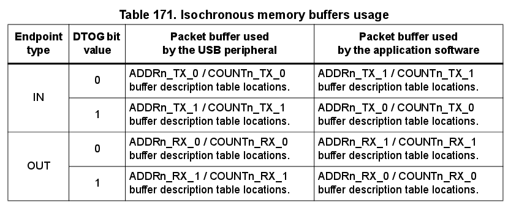

Точно так же, как и в случае с МКТДБ, ргистры `USB_EPnR`, используемые для реализации Изохронных КТ, вынуждены быть однонаправленными. Если нужна Изохронная КТ, умеющая как получать, так и передавать данные, то в этом случае должны быть использованы два регистра  `USB_EPnR`.

За инициализацию бита `DTOG`, в зависимости от того, какой буфер используется первым, отвечает приложение; это должно быть сделано с учётом такого свойства этих двух битов, что они могут только переключаться (toggle). В конце каждой транзакции будет установлен бит `CTR_RX` или `CTR_TX` в регистре `USB_EPnR` запрашиваемой КТ, в зависимости от выбранного направления. В это же время, зависимый бит `DTOG` в регистре `USB_EPnR` переключается аппаратно, делая переключение буферов USB-периферии полностью независимым от ПО. Поле STAT не меняется после окончания транзакции; ввиду того, что Изохронный тип передачи не поддерживает фазу "рукопожатия", Конечная точка остаётся всегда `11` (VALID). Несовпадение CRC и переполнение буфера, возникающие во время Изохронных OUT-передач не считаются ошибками и в любом случае транзакции интерпретируются как корректные и всегда активируют событие `CTR_RX`. Однако, бит `ERR` в регистре `USB_ISTR` всё же будет установлен в случае ошибки CRC, чтобы приложение могло определить возможную порчу данных.

#### 23.4.5. События Приостановки/Возобновления (Suspend/Resume)

Стандарт USB определяет особое сотояние периферийного устройства, называемое "Приостановкой" (SUSPEND), в котором среднее потребление тока от шины USB не должно превышать 2.5 мА. Это требование крайне важно для устройств, питающихся от шины USB, в то время как для устройств с внешним питанием не требуется его чёткого соблюдения.

В режиме Приостановки хост посылает уведомление о недопустимости генерировать какой-либо трафик по USB-шине в течение 3 миллисекунд: поскольку в обычном режиме пекет Начала фрейма (Start of Frame, SOF) шлётся каждую миллисекунду, то отсутствие трёх SOF-пакетов подряд USB-периферия распознаёт как запрос от хоста на Приостановку и устанавливает бит `SUSP` в регистре `USB_ISTR` в `1`, генерируя, тем самым, соответствующее прерывание, если оно включено. Приостановленное устройство может возобновить работу при помощи так называемой RESUME-последовательноси, которую может инициировать хост, либо само устройство непосредственно, но завершает последовательность всегда именно хост.

Приостановленное устройство должно уметь детектировать RESET-последовательность, реагируя на неё, как на обычный Сброс USB.

**Конкретная процедура приостановки** USB-периферии зависит от самого устройства, поэтому для снижения потребления тока могут понадобиться различные действия. Краткое описание обычной процедуры приостановки, акцентирующее внимание на аспектах ПО, отвечающего на SUSPEND-уведомление, в отношении USB, приведено ниже:

1. Установите бит `FSUSP`  в регистре `USB_CNTR` в `1`. Это включит режим Приостановки USB-периферии. Как только режим будет включен, проверка на приём SOF-пакета отключается, чтобы избежать повторной генерации прерывания во время действия Приостановки.
2. Отключите, либо сократите потребление энергии другими блоками, отличными от USB-периферии.
3. Установите бит `LP_MODE` в регистре `USB_CNTR` в `1`, чтобы снизить потребление тока USB-трансивером, но оставить возможность детектирования сигналов о Возобновлении.
4. Дополнительно можно отключить внешний генератор (external oscillator) и PLL, для остановки любой активности внутри устройства.

Если во время Приостановки возникает какое-то USB-событие, то для восстановления режима тактирования и возвращения к обычному поведению должна быть выполнена RESUME-процедура. Особое внимание должно быть уделено тому, чтобы этот процесс не занял больше 10 миллисекунд в случае, когда событием восстановления является Сброс USB (смотрите спецификацию USB для уточнения деталей).

**Возобновление или Сброс USB-периферии**, находящейся в состоянии Приостановки, начинается с асинхронного сброса бита `LP_MODE`  в регистре `USB_CNTR`.

*Несмотря на то, что событие может сгенерировать прерывание WKUP, если оно активно, использовать такое прерывание нужно с осторожностью ввиду большой задержки при перезапуске системного источника тактирования; советуем расположить процедуру Возобновления сразу после процедуры Приостановки, чтобы МК незамедлительно начал выполнение кода с нужного места, как только произойдёт перезапуск системного источника тактирования.*

*Чтобы предотвратить Возобновление системы от случайного статического разряда, либо от других типов помех (выход из Приостановки — асинхронное событие), во время Приостановки активируется соответствующий аналоговый фильтр состояния линии данных; временное разрешение фильтра (filter width) — 70 наносекунд.*

Ниже приведена последовательность действий, которую надо выполнить в процедуре Возобновления:

1. Включите внешний генератор (external oscillator) и/или PLL, если нужно.
2. Очистите бит `FSUSP` в регистре `USB_CNTR`.
3. Если есть необходимость определить источник события Возобновления, то могут быть использованы биты `RXDP` и `RXDM` в регистре `USB_FNR`, значение которых указано в Таблице 172 ниже, в ней же приводится и список действий, которые следует выполнить приложению для каждого из случаев. По необходимости, окончание последовательности Возобновления или Сброса может быть так же определено, по состоянию `10` указанных битов, которое говорит о том, что шина не занята; кроме того, по окончании последовательности Сброса, бит `RESET` в регистре `USB_ISTR` будет установлен в `1`, что сгенерирует соответствующее прерывание, если оно активно, которое должно быть обработано.

Иногда устройству бывает необходимо выйти из режима Приостановки, чтобы ответить на событие, не относящееся к протоколу USB *(как, например, движение мышкой пробуждает всю систему целиком)*. В этом случае последовательность Возобновления может быть начата с установки бита `RESUME` в регистре `USB_CNTR`  в `1` и его сбросом обратно в `0` после интервала в 1—15 миллисекуд (интервал может быть измерен по прерываниям ESOF, генерируемым каждую миллисекунду, если системный источник тактирования работает на номинальной частоте). Как только бит `RESUME` будет вновь очищен, хост самостоятельно завершит необходимую последовательность Возобновления, а её окончание может также быть определено по битам `RXDP` и `RXDM` регистра `USB_FNR`.

*В любом случае, бит `RESUME` должен быть использован только после того, как USB-периферия была переведена в режим Приостановки при помощи установки бита `FSUSP` в регистре `USB_CNTR` в `1`.*

### 23.5. Регистры USB

Регистры USB-периферии могут быть поделены на следующие три группы:

- **Общие регистры**: регистры управления и прерываний.
- **Регистры Конечных точек**: конфигурация и статус КТ.
- **Таблица дескрипторов буферов**: расположение буферов в пакетной памяти.

Адреса всех регистров записаны как смещение относительно базового адреса USB-периферии — `0x40005c000`, за исключением таблицы дескрипторов буферов, которая располагается в пакетной памяти по локальному адресу, указываемому в регистре `USB_BTABLE`.

Ввиду ограничений моста APB1 относительно возможностей адресации, адреса всех регистров выровнены по 32-битной границе слова, но сами регистры 16-битные. Такое же выравнивание адресов используется при доступе к Пакетным буферам, память которых начинается с `0x40006000`.

Регистры могут быть доступны как по полслова (16 бит), так и по целому слову (32 бита).

*Сокращения, ипользованные при описании регистров приведены в Разделе 2.2, на странице 45.*

#### 23.5.1. Общие регистры

Эти регистры влияют на поведение USB-периферии в целом, определяя её режим, обработку прерываний, USB-адрес устройства и позволяют узнать номер текущего фрейма, который обновляется хостом.

##### Управляющий регистр USB (control, `USB_CNTR`)

    Смещение адреса:        0x40
    Значение после сброса:  0x0003

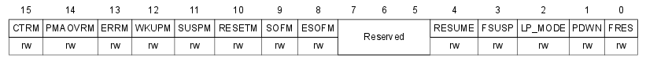

- 15:   `CTRM`  
**Маска прерывания успешной передачи CTR** (correct transfer)
    - **0**: Прерывание CTR отключено.
    - **1**: Прерывание CTR включено. Прерывание генерируется, если в регистре USB_ISTR установлен соответствующий бит.
- 14:   `PMAOVRM`  
**Маска прерывания переполнения/опустошения буфера** (packet memory area over/underrun)
    - **0**: Прерывание PMAOVR отключено.
    - **1**: Прерывание PMAOVR включено. Прерывание генерируется, если в регистре USB_ISTR установлен соответствующий бит.
- 13:   `ERRM`  
**Маска прерывания ошибки** (error)
    - **0**: Прерывание ERR отключено.
    - **1**: Прерывание ERR включено. Прерывание генерируется, если в регистре USB_ISTR установлен соответствующий бит.
- 12:   `WKUPM`  
**Маска прерывания Возобновления** (wakeup)
    - **0**: Прерывание WKUP отключено.
    - **1**: Прерывание WKUP включено. Прерывание генерируется, если в регистре USB_ISTR установлен соответствующий бит.
- 11:   `SUSPM`  
**Маска прерывания Приостановки** (suspend)
    - **0**: Прерывание SUSP отключено.
    - **1**: Прерывание SUSP включено. Прерывание генерируется, если в регистре USB_ISTR установлен соответствующий бит.
- 10:   `RESETM`  
**Маска прерывания Сброса USB** (USB reset)
    - **0**: Прерывание RESET отключено.
    - **1**: Прерывание RESET включено. Прерывание генерируется, если в регистре USB_ISTR установлен соответствующий бит.
- 9:   `SOFM`  
**Маска прерывания Начала фрейма (SOF)** (start of frame)
    - **0**: Прерывание SOF отключено.
    - **1**: Прерывание SOF включено. Прерывание генерируется, если в регистре USB_ISTR установлен соответствующий бит.
- 8:   `ESOFM`  
**Маска прерывания ожидавшегося Начала фрейма** (expected start of frame)
    - **0**: Прерывание ESOF отключено.
    - **1**: Прерывание ESOF включено. Прерывание генерируется, если в регистре USB_ISTR установлен соответствующий бит.
- 4:   `RESUME`  
**Запрос на Возобновление** (resume request)
    - ПО может установить этот бит, чтобы отправить RESUME-сигнал хосту. Он должен быть активирован на не менее, чем 1 мс и не более, чем 15 мс, после чего хост будет готов провести последовательность Возобновления до конца.
- 3:   `FSUSP`  
**Принудительная Приостановка** (force suspend)
    - Приложение должно установить этот бит, как только получено прерывание SUSP, которое генерируется, если трафик на линии отсутствует в течение 3 мс.
    - **0**: -
    - **1**: Перейти в режим Приостановки. Энергопотребление и тактировани трансивера остаётся прежним. Для снижения энергопотребления ПО должно включить бит LP_MODE после FSUSP.
- 2:   `LP_MODE`  
**Режим низкого энергопортебления** (low-power mode)
    - Включает пониженное потребление для режима Приостановки. Бит сбрасывается автоматически, при активности на линии.
    - **0**: Нормальное энергопотребление.
    - **1**: Пониженное энергопотребление.
- 1:   `PDWN`  
**Выключение** (power down)
    - Полностью отключает аналоговую часть USB.
    - **0**: Включает аналоговую часть.
    - **1**: Отключает аналоговую часть.
- 0:   `FRES`  
**Принудительный Сброс USB** (force USB reset)
    - **0**: Убирает Сброс USB.
    - **1**: Вызывает принудительный Сброс USB-периферии. Очищается приложением. Генерирует прерывание RESET, если оно активно.

##### Регистр состояния прерываний USB (interrupt status, `USB_ISTR`)

    Смещение адреса:        0x44
    Значение после сброса:  0x0000

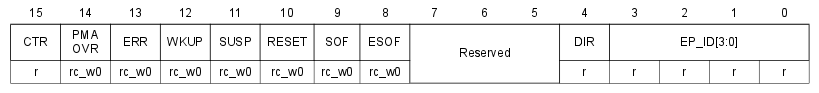

Регистр содержит информацию обо всех источниках прерываний, давая возможность приложению определить какое именно событие вызвало прерывание.

Приложение ответственно за очистку флагов прерываний. Флаги очищаются записью в них нуля.

- 15:   `CTR`  
**Успешная передача** (correct transfer)
    - Устанавливается и очищается аппаратно. Обозначает успешное окончание транзакции.
- 14:   `PMAOVR`  
**Переполнение/опустошение буфера** (packet memory area over/underrun)
    - Бит устанавливается, если МК не успел ответить на запрос памяти.
- 13:   `ERR`  
**Ошибка** (error)
    - Бит устанавливается в следующих случаях: NANS — хост не отвечает; CRC — несовпадение контрольной суммы; BST — ошибка вставки дополнительного бита; FVIO — нарушение формата фрейма. USB-периферия сама восстанавливается от подобного рода ошибок.
- 12:   `WKUP`  
**Возобновление** (wakeup)
    - Устанавливается в 1, если во время Приостановки наблюдается активность на линии. Это обытие очищает бит LP_MODE в регистре USB_CNTR.
- 11:   `SUSP`  
**Приостановка** (suspend mode request)
    - Устанавливается в 1, если на линии в течение 3 мс отсутствует какой-либо трафик, что обозначает запрос Приостановки от хоста.
- 10:   `RESET`  
**Сброс USB** (USB reset request)
    - Устанавливается в 1, если USB-периферия обнаруживает USB-запрос на сброс. USB-периферия сбрасывает своё внутреннее состояние, регистры USB_EPnR и USB_DADDR и генерирует прерывание, если установлен бит RESETM в регистре USB_CNTR. Регистры конфигурации USB-периферии не сбрасываются. Приём и передача отключены до тех пор, пока бит не будет сброшен. Установка бита FRES в регистре USB_CNTR устанавливает бит RESET.
- 9:   `SOF`  
**Начало фрейма** (start of frame)
    - Указывает на то, что начался новый фрейм. Бит может быть использован для 1-миллисекундной синхронизации.
- 8:   `ESOF`  
**Ожидалось начало фрейма** (expected start of frame)
    - Устанавливается аппаратно в случае, если ожидавшийся SOF-пакет не был получен.
- 4:   `DIR`  
**Направление передачи** (direction of transaction)
    - Изменяется аппаратно. Обозначает направление передачи.
    - **0**: IN-транзакция. Установлен бит CTR_TX в регистре USB_EPnR.
    - **1**: OUT-транзакция. Установлен бит CTR_RX в регистре USB_EPnR. Либо установлены оба бита — CTR_TX и CTR_RX, в случае двух разных типов транзакций.
- [3-0]:   `EP_ID`  
**Идентификатор Конечной точки** (endpoint identifier)
    - Изменяется аппаратно. Содержит номер КТ, сгенерировавшей прерывание. Если одновременно несколько КТ генерируют прерывание, то записывается номер КТ с наивысшим приоритетом обслуживания: у Изохронных КТ и МКТДБ приоритет выше, чем у обычных. Если же прерывание сгенерировани несколько КТ с одинаковым приоритетом, то в поле записывается КТ с меньшим номером: КТ-0 будет иметь наивысший приоритет.

##### Регистр номера фрейма USB (frame number, `USB_FNR`)

    Смещение адреса:        0x48
    Значение после сброса:  0x0XXX (X - значение не определено)

- 15:   `RXDP`  
**Состояние линии DP+ при приёме** (receive data+ line status)
    - Бит может быть использован для выяснения статуса линии в конце процедуры Приостановки, для выяснения причины пробуждения.
- 14:   `RXDM`  
**Состояние линии DM- при приёме** (receive data- line status)
    - Бит может быть использован для выяснения статуса линии в конце процедуры Приостановки, для выяснения причины пробуждения.
- 13:   `LCK`  
**Заблокирован** (locked)
    - Устанавливается аппаратно после того, как будут приняты по меньшей мере два SOF-пакета по окончании Сброса USB или последовательности Возобновления. Фрейм-таймер остаётся заблокированным до следующего сброса или Приостановки.
- 12-11:   `LSOF`  
**Потерянный SOF** (lost SOF)
    - Устанавливается аппаратно во время генерации ESOF-прерывания и обозначает число потерянных фреймов. Если в дальнейшем пакет всё же поступит, то поле очищается.
- 10-0:   `FN`  
**Номер фрейма** (frame number)
    - Содержит номер фрейма из последнего принятого SOF-пакета. Номер увеличивается с каждым новым фреймом. Значение может быть полезно для Изохронных передач. Поле обновляется во время генерации SOF-прерывания.

##### Адрес устройства USB (device address, `USB_DADDR`)

    Смещение адреса:        0x4c
    Значение после сброса:  0x0000

- 7:   `EF`  
**Вкл** (enable function)
    - Включает USB. Если бит равен 0, то USB-транзакции не будут обрабатываться, независимо от состояния других регистров.
- 6-0:   `ADD`  
**USB-адрес устройства** (device address)
    - Поле содержит адрес устройства, назначаемый хостом во время процеса перечисления.

##### Адрес таблицы буферов (buffer table address, `USB_BTABLE`)

    Смещение адреса:        0x50
    Значение после сброса:  0x0000

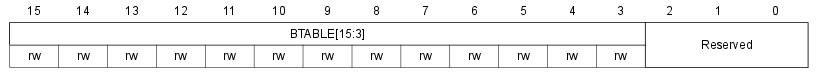

Регистр содержит адрес таблицы дескрипторов буферов в специальной пакетной памяти. Младшие три бита должны быть нулями, так как записи в таблице должны быть выровнены по 8-байтной границе.

#### 23.5.2. Регистры Конечных точек

##### Регистры КТ-n, n=[0..7] (USB endpoint n register, `USB_EPnR`)

    Смещение адреса:        0x00, 0x04, 0x08, 0x0c,
                            0x10, 0x14, 0x18, 0x1c
    Значение после сброса:  0x0000

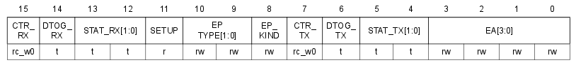

При сбросе регистров через бит FRES регистра CNTR, биты CTR_RX и CTR_TX не сбрасываются, чтобы не пропустить оповещение об успешной транзакции, которое может случиться сразу после сброса.

*Желательно избегать операции чтения-изменения-записи в эти регистры, так как между чтением и записью некоторые биты могут быть изменены аппаратно. Для каждого из изменяемых аппаратно битов предусмотрено специальное значение, которое их не изменяет. Рекомендуется менять регистры простой инструкцией загрузки (ldr) с установкой битов, которе не требуется менять, в их "инвариантные" значения.*

- 15:   `CTR_RX`  
**Успешный приём** (correct transfer rx)
    - Устанавливается аппаратно при успешной OUT/SETUP транзакции. ПО может только очистить этот бит, записав 0.
- 14:   `DTOG_RX`  
**Переключаемый бит приёма** (data toggle rx)
    - Переключается аппаратно, после того как хосту отправлен ACK. Также используется для переключения буферов, если используется двойная буферизация (смотри Раздел 23.4.3.). Переключается записью 1.
    - **0**: Данные передаются в пакете DATA0, если КТ не Изохронная.
    - **1**: Данные передаются в пакете DATA1, если КТ не Изохронная.
- 13-12:   `STAT_RX`  
**Состояние при приёме** (status rx)
    - Смотри Таблицу 173 ниже. Биты только переключаются записью в них 1.
- 11:   `SETUP`  
**Завершение SETUP-транзакции** (setup transaction completed)
    - Обозначает, что последней была SETUP-транзакция. Актуально только для управляющих КТ.
- 10-9:   `EP_TYPE`  
**Тип Конечной точки** (endpoint type)
    - Поле определяет поведение КТ. Смотри Таблицу 174 ниже. КТ-0 всегда должна быть управляющей.
- 8:   `EP_KIND`  
**Вариант Конечной точки** (endpoint kind)
    - Назначение поля зависит от типа КТ (от поля EP_TYPE), смотри Таблицу 175 ниже.
    - DBL_BUF: на КТ включена двойная буферизация.
    - STATUS_OUT: значение устанавивает ПО для обозначения, что ожидается транзакция STATUS OUT. На другие OUT-транзакции, содержащие байты данных, отправляется STALL. Значение предназначено только для управляющих КТ.
- 7:   `CTR_TX`  
**Успешная отправка** (correct transfer tx)
    - Устанавливается аппаратно при успешной IN-транзакции. ПО может только очистить этот бит, записав 0.
- 6:   `DTOG_TX`  
**Переключаемый бит отправки** (data toggle tx)
    - Переключается аппаратно, после того как от хоста получен ACK. Также используется для переключения буферов, если используется двойная буферизация (смотри Раздел 23.4.3.). Переключается записью 1.
    - **0**: Данные передаются в пакете DATA0, если КТ не Изохронная.
    - **1**: Данные передаются в пакете DATA1, если КТ не Изохронная.
- 5-4:   `STAT_TX`  
**Состояние при отправке** (status tx)
    - Смотри Таблицу 176 ниже. Биты только переключаются записью в них 1.
- 3-0:   `EA`  
**Адрес Конечной точки** (endpoint address)
    - ПО должно записать адрес КТ в это поле до её включения.

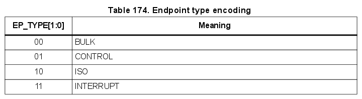

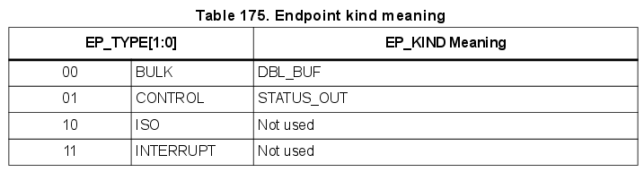

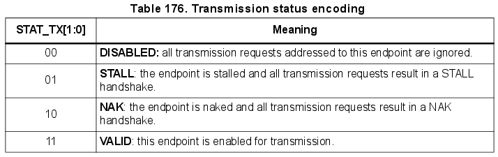

#### 23.5.3. Таблица дескрипторов буферов

Хоть таблица и расположена в пакетной памяти, записи в ней могут рассмотриваться как дополниельные регистры, служащие для настройки Пакетных буферов.

Ввиду ограничений моста APB, доступ к пакеной памяти происходит по адресам, выровненным по 32-битной границе.

Чтобы получить правильный адрес для использования в приложении, адрес пакетной памяти нужно умножить на 2. Первый адрес пакетной памяти — `0x40006000`.

Для Конечных точек с двойной буферизацией, в том числе Изохронных, регистры противоположного направления используются для описания второго буфера. Синонимы для регистров TX: TX_0, RX_0; для регистров RX: TX_1, RX_1.

##### Адрес буфера отправки n (`USB_ADDRn_TX`)

    Смещение адреса:    [USB_BTABLE] + (n*8 + 0)*2
    Локальное смещение: [USB_BTABLE] + (n*8 + 0)

Указывает на начало Пакетного буфера, содержащего данные для отправки по IN-транзакции.

##### Количество отправляемых байтов n (`USB_COUNTn_TX`)

    Смещение адреса:    [USB_BTABLE] + (n*8 + 2)*2
    Локальное смещение: [USB_BTABLE] + (n*8 + 2)

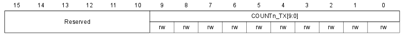

В регистр записывается количество байтов, которые нужно отправить по IN-транзакции.

##### Адрес буфера приёма n (`USB_ADDRn_RX`)

    Смещение адреса:    [USB_BTABLE] + (n*8 + 4)*2
    Локальное смещение: [USB_BTABLE] + (n*8 + 4)

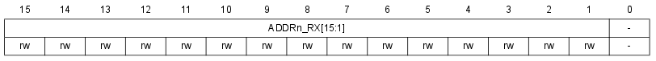

Указывает на начало Пакетного буфера, в который будут записываться принимаемые OUT/SETUP-транзакции данные.

##### Количество принятых байтов n (`USB_COUNTn_RX`)

    Смещение адреса:    [USB_BTABLE] + (n*8 + 6)*2
    Локальное смещение: [USB_BTABLE] + (n*8 + 6)

Регистр содержит два значения:

- размер буфера для принимаемых данных
- и количество принятых байтов.

Размер буфера в зависимости от значения полей может быть определён по Таблице 177 ниже.

- 15:   `BLSIZE`  
**Размер блока** (block size)
    - **0**: Размер блока — 2 байта.
    - **1**: Размер блока — 32 байта.
- 14-10:   `NUM_BLOCK`  
**Количество блоков** (number of blocks)
    - В поле указывается размер буфера в блоках.
- 9-0:   `COUNTn_RX`  
**Количество принятых байтов** (reception byte count)
    - Счётчик байтов, принятых по OUT/SETUP-транзакции.

#### 23.5.4. Карта регистров USB

